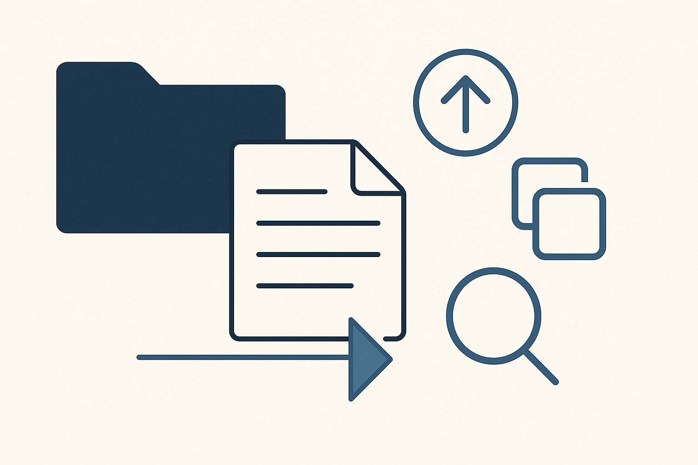
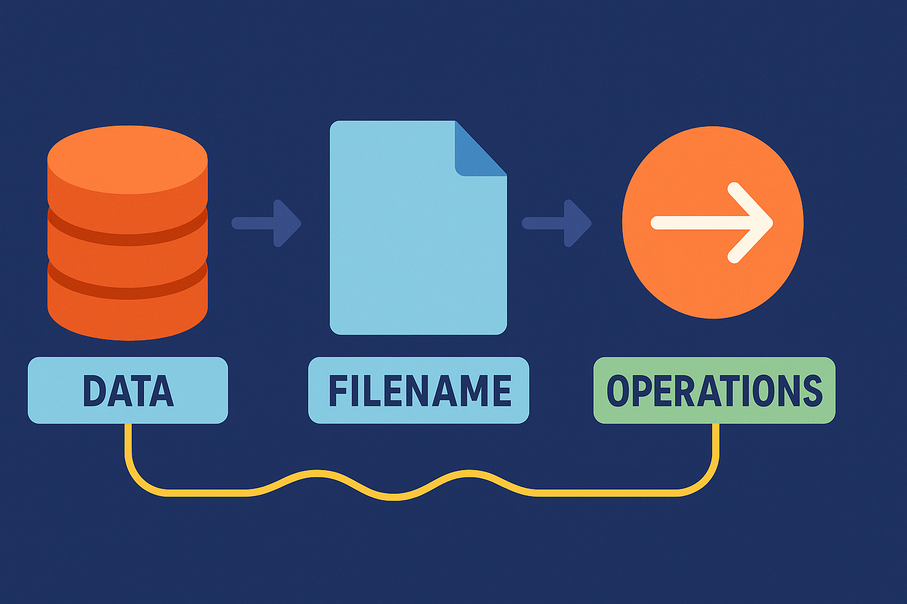

<!--
author: Herr J. Müller

titel: Netzwerkdienste einrichten und administrieren (I)

icon: assets/BSO_LOGO_1.png

email:  Jan.Mueller4@schule.hessen.de

version:  0.1.0

language: de

narrator: Deutsch Female

comment: https://liascript.github.io/course/?https://raw.githubusercontent.com/JMueller-edu/SJ2425/refs/heads/main/LF14BFIT.md#1

link:     https://cdn.jsdelivr.net/chartist.js/latest/chartist.min.css

script:   https://cdn.jsdelivr.net/chartist.js/latest/chartist.min.js

import: https://raw.githubusercontent.com/liaScript/mermaid_template/master/README.md

-->

# Linux 

## Name vs. Inhalt

**Fundamentale Idee**

>Daten sind etwas anderes als die Bezüge darauf. Dateien, Pfade und Befehle sind nur Werkzeuge, um auf Daten zuzugreifen, sie umzuleiten oder zu transformieren.

---

**Impulsfragen:**

     {{1}}
<section>

>Warum ist es für den Computer praktisch, dass eine Datei und ihr Name nicht dasselbe sind – so ähnlich wie bei einem Preisschild und einem Artikel?

Erwartungshorizont

- Wie beim Austausch des Preisschilds: Man muss nicht das ganzen Artikel neu besorgen, man stellt nur das Schild im Regal um → genau so ist mv schnell.
- Entfernt man den Preis von einem Artikel existiert dieser weiter.
- Unterschiedliche Preise können auf denselben Artikel zeigen → wie Hardlinks.

**Kernbotschaft:**
Diese Trennung macht Linux schnell, unkompliziert und robust, genau wie ein gut organisiertes Supermarktregal.

</section>

     {{2}}
<section>

>Wie verändert es unsere Vorstellung vom „Löschen“, wenn wir erfahren, dass beim Löschen einer Datei oft nur das „Namensschild“ entfernt wird – nicht der Inhalt selbst?

Erwartungshorizont

- Viele Menschen glauben: „Weg ist weg.“ Im Alltag entspricht das dem Entfernen eines Namensetiketts auf einer Box – der Inhalt ist aber noch drin.
- Diese falsche Vorstellung kann zu riskantem Verhalten führen (man glaubt, private Daten seien sofort weg).
- Das wirkt sich auf Vertrauen, Datenschutz und digitale Gewohnheiten aus.

**Kernbotschaft:**
Wir lernen, dass „löschen“ digital oft etwas anderes bedeutet als im echten Leben – und das hat Folgen.

</section>

     {{3}}
<section>

>Welche Probleme können im Alltag entstehen, wenn man denkt, eine Datei sei komplett weg, obwohl nur ihr „Namensschild“ gelöscht wurde?

Erwartungshorizont

- Daten könnten weiterhin auffindbar oder wiederherstellbar sein → riskant bei sensiblen Dateien.
- Programme könnten Daten weiter benutzen, obwohl man denkt, sie seien weg.
- Backups oder automatisierte Abläufe könnten falsch funktionieren, wenn man den Unterschied nicht versteht.
- Man könnte versehentlich glauben, Daten seien sicher gelöscht, obwohl sie es nicht sind.

**Kernpunkt:**
Falsches Verständnis kann zu Datenpannen und Arbeitsfehlern führen.

</section>

----

**Anwendungsbezogenes Beispiel:**

     {{4}}
<section>

>Linux betrachtet Daten, Namen und Operationen als strikt getrennte Ebenen. Befehle arbeiten nicht an „Dingen“, sondern an Verweisen und Datenströmen. Dadurch bleibt das System einfach, flexibel und universell.

</section>

**Einzelarbeit:**

         {{5}}
<section>

1. Rufe den [Login der Cisco Networking Academy](https://www.netacad.com/) auf!

2. Melde dich dort mit deinen Zugangsdaten an.
   
3. Wähle nach dem Login im Dashboard unter `My Classes` den Kurs `11BFIT Linux Unhatched` aus.
   
4. Wähle in der Kapitelübersicht das `10 Anzeigen von Dateien` aus.
   
5. Bearbeite das Kapitel `10 - 13`!

    - ***Erstelle dir dabei Notizen nach der [Cornell-Methode](https://www.youtube.com/watch?v=nX-xshA_0m8)*** 

    - ***Du kannst dafür diese [Vorlage](assets/cornellNotes.pdf) verwenden***
</section>

---

**Plenumsdiskussion:**

     {{6}}
<section>

>Welche Vor- und Nachteile hat die Trennung von Daten, Namen und Operationen für uns?

Erwartungshorizont

**Vorteile:**

- Effizienz: schnelles Verschieben/Umbenennen, keine großen Datenmengen werden bewegt
- Sicherheit: offene Dateien bleiben nutzbar, Operationen sind atomar
- Flexibilität: mehrere Namen (Hardlinks), Umleitung von Datenströmen
- Robustheit: System funktioniert stabil, auch bei Abstürzen

**Nachteile / Herausforderungen:**

- Missverständnisse: Nutzer*innen glauben, Daten seien gelöscht, obwohl sie noch existieren
- Datenschutzrisiken: wiederherstellbare Inhalte, ungewollte Reste
- Komplexität: Erklärungsbedarf für Menschen ohne technischen Hintergrund
- Fehlerquellen: Backups oder Skripte können unvollständig sein, wenn nur Namen berücksichtigt werden

</section>

