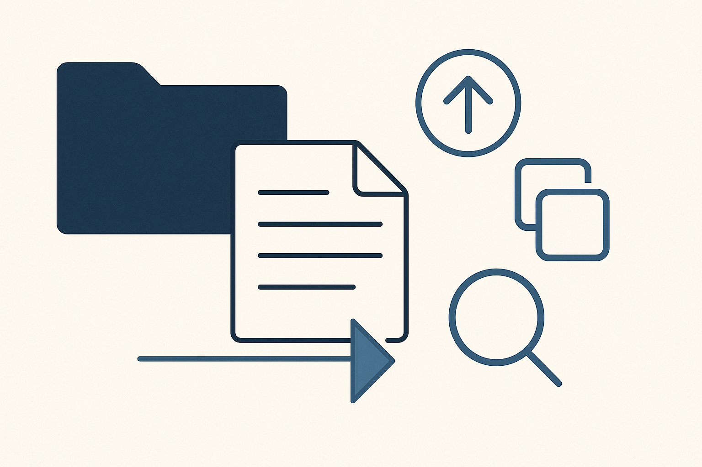
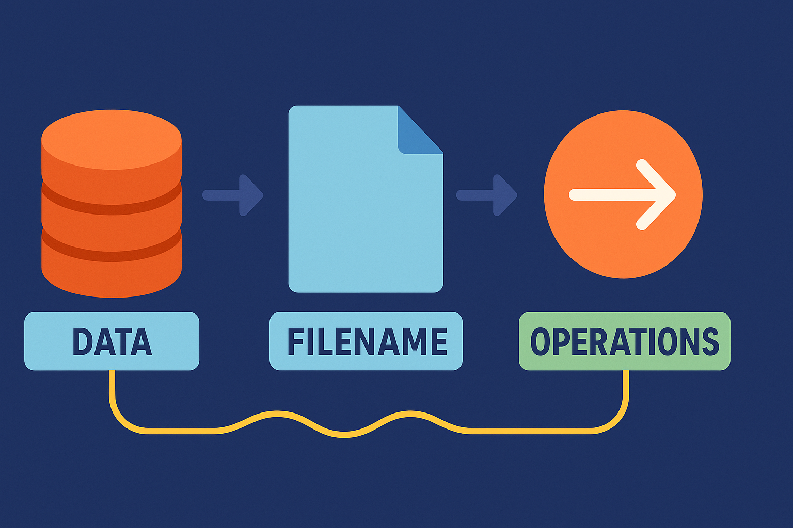
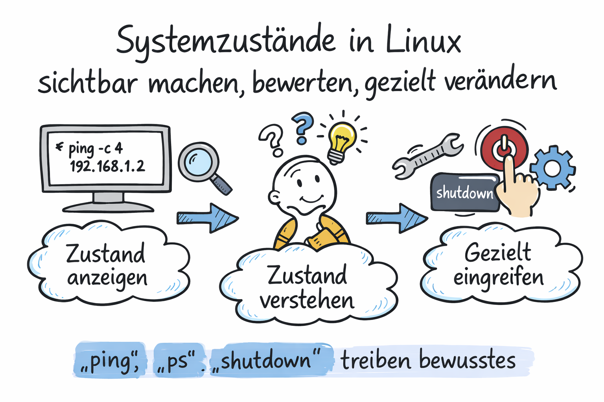
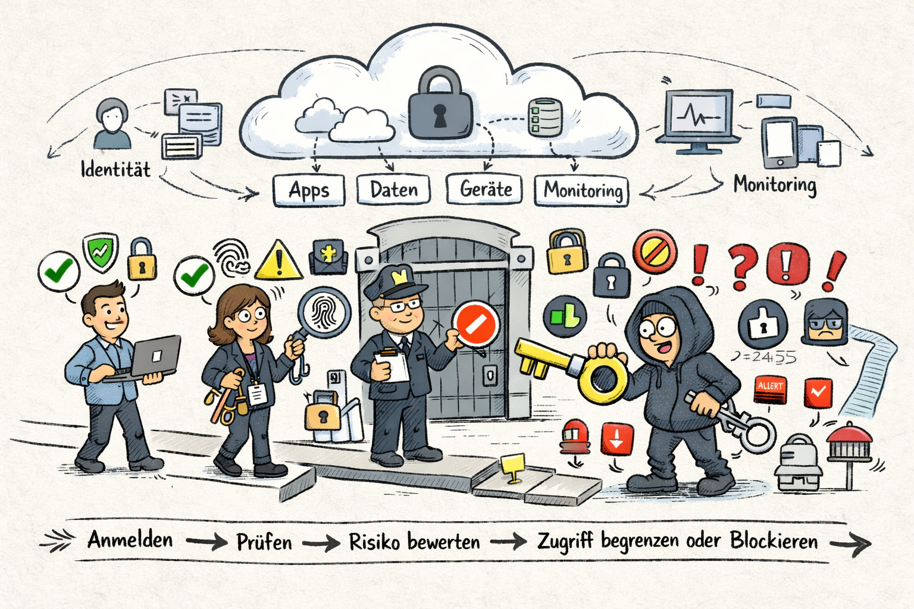
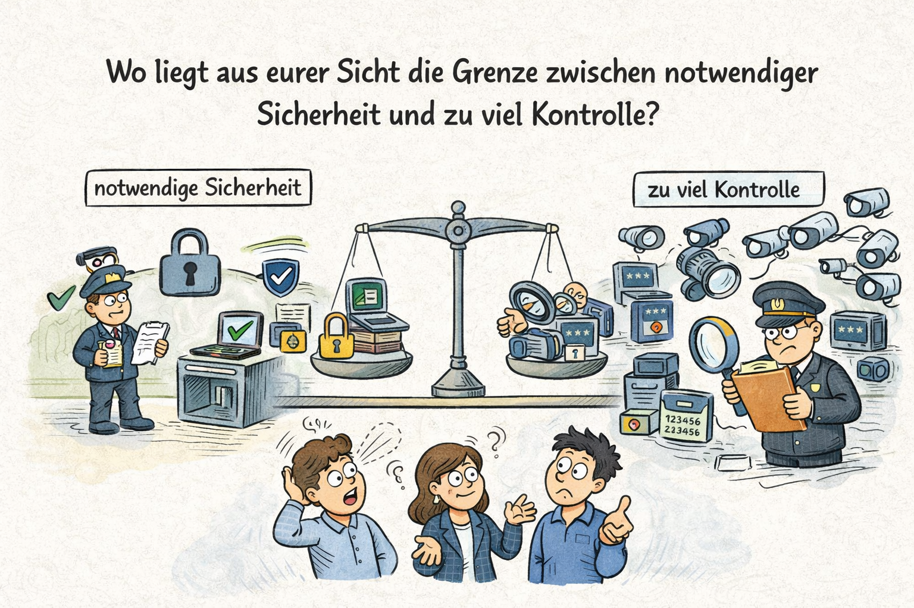
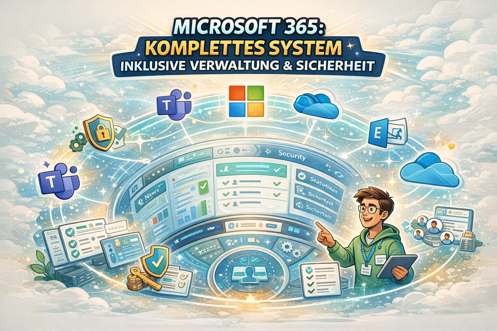

<!--
author: Herr J. Müller

titel: LF09 11HBFIT SJ 25/26

icon: assets/BSO_LOGO_1.png

email:  Jan.Mueller4@schule.hessen.de

version:  0.1.0

language: de

narrator: Deutsch Female

comment: https://liascript.github.io/course/?https://raw.githubusercontent.com/JMueller-edu/SJ2526/refs/heads/main/LF09BFIT2526.md#1

link:     https://cdn.jsdelivr.net/chartist.js/latest/chartist.min.css

script:   https://cdn.jsdelivr.net/chartist.js/latest/chartist.min.js

import: https://raw.githubusercontent.com/liaScript/mermaid_template/master/README.md

-->

# Linux 

## Name vs. Inhalt

**Fundamentale Idee**

<section>

***Daten sind etwas anderes als die Bezüge darauf.***  
***Dateien, Pfade und Befehle sind nur Werkzeuge, um auf Daten zuzugreifen, sie umzuleiten oder zu transformieren.***

</section>

---

**Impulsfragen:**

     {{1-2}}
<section>

>Warum ist es für den Computer praktisch, dass eine Datei und ihr Name nicht dasselbe sind – so ähnlich wie bei einem Preisschild und einem Artikel?

Erwartungshorizont

- Wie beim Austausch des Preisschilds: Man muss nicht das ganzen Artikel neu besorgen, man stellt nur das Schild im Regal um → genau so ist mv schnell.
- Entfernt man den Preis von einem Artikel existiert dieser weiter.
- Unterschiedliche Preise können auf denselben Artikel zeigen → wie Hardlinks.

**Kernbotschaft:**
Diese Trennung macht Linux schnell, unkompliziert und robust, genau wie ein gut organisiertes Supermarktregal.

</section>

     {{2-3}}
<section>

>Wie verändert es unsere Vorstellung vom „Löschen“, wenn wir erfahren, dass beim Löschen einer Datei oft nur das „Namensschild“ entfernt wird – nicht der Inhalt selbst?

Erwartungshorizont

- Viele Menschen glauben: „Weg ist weg.“ Im Alltag entspricht das dem Entfernen eines Namensetiketts auf einer Box – der Inhalt ist aber noch drin.
- Diese falsche Vorstellung kann zu riskantem Verhalten führen (man glaubt, private Daten seien sofort weg).
- Das wirkt sich auf Vertrauen, Datenschutz und digitale Gewohnheiten aus.

**Kernbotschaft:**
Wir lernen, dass „löschen“ digital oft etwas anderes bedeutet als im echten Leben – und das hat Folgen.

</section>

     {{3-4}}
<section>

>Welche Probleme können im Alltag entstehen, wenn man denkt, eine Datei sei komplett weg, obwohl nur ihr „Namensschild“ gelöscht wurde?

Erwartungshorizont

- Daten könnten weiterhin auffindbar oder wiederherstellbar sein → riskant bei sensiblen Dateien.
- Programme könnten Daten weiter benutzen, obwohl man denkt, sie seien weg.
- Backups oder automatisierte Abläufe könnten falsch funktionieren, wenn man den Unterschied nicht versteht.
- Man könnte versehentlich glauben, Daten seien sicher gelöscht, obwohl sie es nicht sind.

**Kernpunkt:**
Falsches Verständnis kann zu Datenpannen und Arbeitsfehlern führen.

</section>

----

**Anwendungsbezogenes Beispiel:**

     {{4-5}}
<section>

<section>

***Linux betrachtet Daten, Namen und Operationen als strikt getrennte Ebenen.***  
***Befehle arbeiten nicht an „Dingen“, sondern an Verweisen und Datenströmen.***  
***Dadurch bleibt das System einfach, flexibel und universell.***  

</section>

</section>

---

**Einzelarbeit:**

     {{5-6}}
<section>

1. Rufe den [Login der Cisco Networking Academy](https://www.netacad.com/) auf!

2. Melde dich dort mit deinen Zugangsdaten an.
   
3. Wähle nach dem Login im Dashboard unter `My Classes` den Kurs `11BFIT Linux Unhatched` aus.
   
4. Wähle in der Kapitelübersicht das `10 Anzeigen von Dateien` aus.
   
5. Bearbeite das Kapitel `10 - 13`!

    - ***Erstelle dir dabei Notizen nach der [Cornell-Methode](https://www.youtube.com/watch?v=nX-xshA_0m8)*** 

    - ***Du kannst dafür diese [Vorlage](assets/cornellNotes.pdf) verwenden***
</section>

---

**Plenumsdiskussion:**

     {{6}}
<section>

>Welche Vor- und Nachteile hat die Trennung von Daten, Namen und Operationen für uns?

Erwartungshorizont

**Vorteile:**

- Effizienz: schnelles Verschieben/Umbenennen, keine großen Datenmengen werden bewegt
- Sicherheit: offene Dateien bleiben nutzbar, Operationen sind atomar
- Flexibilität: mehrere Namen (Hardlinks), Umleitung von Datenströmen
- Robustheit: System funktioniert stabil, auch bei Abstürzen

**Nachteile / Herausforderungen:**

- Missverständnisse: Nutzer*innen glauben, Daten seien gelöscht, obwohl sie noch existieren
- Datenschutzrisiken: wiederherstellbare Inhalte, ungewollte Reste
- Komplexität: Erklärungsbedarf für Menschen ohne technischen Hintergrund
- Fehlerquellen: Backups oder Skripte können unvollständig sein, wenn nur Namen berücksichtigt werden

</section>

## Muster beschreiben - Informationen finden

>Moderne technische Systeme arbeiten nicht mit einzelnen Objekten, sondern mit abstrakten Mustern.   Anstatt konkrete Fälle von Hand zu bearbeiten, erstellt man Regeln. Diese Regeln helfen dabei, wichtige Informationen automatisch zu erkennen und zu verarbeiten.

---

**Impulsfragen:**

     {{1-2}}
<section>

>Wo verwendet ihr im Alltag Mustererkennung, um Informationen zu finden oder zu verarbeiten?

</section>

     {{2-3}}
<section>
>Warum verwendet ihr diese Mustererkennung?

</section>

---

**Anwendungsbezogenes Beispiel:**

     {{3-4}}
<section>

>Linux versteht Daten als fließende Texte und arbeitet mit abstrakten Suchmustern.   Statt Inhalte manuell zu durchsuchen, beschreibt man Regeln, nach denen relevante Informationen automatisch erkannt werden.

</section>

---

**Einzelarbeit:**

     {{4-5}}
<section>

1. Rufe den [Login der Cisco Networking Academy](https://www.netacad.com/) auf!

2. Melde dich dort mit deinen Zugangsdaten an.
   
3. Wähle nach dem Login im Dashboard unter `My Classes` den Kurs `11BFIT Linux Unhatched` aus.
   
4. Bearbeite das Kapitel `14`, `14.1`, `14.2`!

    - ***Erstelle dir dabei Notizen nach der [Cornell-Methode](https://www.youtube.com/watch?v=nX-xshA_0m8)*** 

    - ***Du kannst dafür diese [Vorlage](assets/cornellNotes.pdf) verwenden***

5. Absolviere das folgende Quiz.

</section>

---

**Quiz:**

     {{5-6}}
<section>
Was beschreibt der Befehl `grep` im Kontext von Linux am besten?

<!-- data-solution-button="off" data-randomize -->
- [( )] Ein Dateiverwaltungsbefehl
- [( )] Ein Texteditor
- [(X)] Ein Textfilter
- [( )] Ein Benutzerverwaltungsprogramm
</section>

     {{6-7}}
<section>
Welche allgemeine Syntax hat der Befehl `grep`?

<!-- data-solution-button="off" data-randomize -->
- [( )] `grep DATEI MUSTER [OPTIONEN]`
- [(X)] `grep MUSTER [DATEI]`
- [( )] `grep [DATEI] OPTIONEN MUSTER`
- [( )] `grep OPTIONEN DATEI MUSTER`
</section>

     {{7-8}}
<section>
Welche Aussage fasst den Zweck von regulären Ausdrücken am besten zusammen?

<!-- data-solution-button="off" data-randomize -->
- [( )] Sie verändern Dateien automatisch
- [(X)] Sie beschreiben Regeln, nach denen Text erkannt wird
- [( )] Sie speichern Benutzerinformationen
- [( )] Sie ersetzen Linux-Befehle
</section>

     {{8-9}}
<section>
Welche zwei Arten von regulären Ausdrücken werden unterschieden?

<!-- data-solution-button="off" data-randomize -->
- [( )] Kurze und lange Regex
- [( )] Einfache und komplexe Regex
- [(x)] Basic (einfache) und Extended (erweiterte) Regex
- [( )] Lokale und globale Regex
</section>

     {{9-10}}
<section>
Warum sollten Regex-Muster oft in einfache Anführungszeichen gesetzt werden?

<!-- data-solution-button="off" data-randomize -->
- [( )] Damit grep schneller arbeitet
- [( )] Damit die Datei geschützt wird
- [(x)] Damit die Shell Sonderzeichen nicht falsch interpretiert
- [( )] Damit Farben angezeigt werden
</section>

     {{10-11}}
<section>
Was passiert, wenn bei grep kein Dateiname angegeben wird?

<!-- data-solution-button="off" data-randomize -->
- [( )] grep beendet sich sofort
- [(x)] grep liest von der Standardeingabe
- [( )] grep zeigt eine Fehlermeldung
- [( )] grep durchsucht automatisch alle Dateien
</section>

---

**Plenumsdiskussion:**

     {{11-12}}
>Was bedeutet es für unsere Gesellschaft, wenn immer häufiger Regeln entscheiden, welche Informationen wir sehen?

---

## Systemzustände kontrollieren

     {{0-1}}
<section>

Um ein System sicher zu bedienen, sollte man zunächst seinen aktuellen Zustand anzeigen und verstehen, bevor man gezielt eingreift.
</section>

---

**Impulsfragen:**

     {{1-2}}
<section>

>Hast du schon einmal ein Problem verschlimmert, weil du etwas gemacht hast, ohne genau zu wissen, was los war?

</section>

     {{2-3}}
<section>

>Welche Anzeichen zeigen dir, dass ein System noch arbeitet – und wann es besser ist, nicht einzugreifen?

</section>

---

**Anwendungsbezogenes Beispiel:**

     {{3-4}}
<section>

In Linux werden Systemzustände mit Befehlen sichtbar gemacht, anschließend bewertet und erst dann gezielt verändert. Werkzeuge wie `ping`, `ps` oder `shutdown` helfen dabei, bewusst und kontrolliert in das System einzugreifen.

</section>

---

**Einzelarbeit:**

     {{4-5}}
<section>

1. Rufe den [Login der Cisco Networking Academy](https://www.netacad.com/) auf!

2. Melde dich dort mit deinen Zugangsdaten an.
   
3. Wähle nach dem Login im Dashboard unter `My Classes` den Kurs `11BFIT Linux Unhatched` aus.
   
4. Bearbeite die Kapitel `15`, `16` und `17`!

    - ***Erstelle dir dabei Notizen nach der [Cornell-Methode](https://www.youtube.com/watch?v=nX-xshA_0m8)*** 

    - ***Du kannst dafür diese [Vorlage](assets/cornellNotes.pdf) verwenden***

5. Absolviere das folgende Quiz.

</section>

---

**Quiz:**

     {{5-6}}
<section>
Welches grundlegende Ziel verfolgt man, wenn man unter Linux zunächst Befehle wie `ifconfig` oder `ps` ausführt?

<!-- data-solution-button="off" data-randomize -->
- [( )] Die sofortige Behebung eines Problems
- [(X)] Das Erfassen des aktuellen Systemzustands
- [( )] Das Erzwingen einer Systemänderung
- [( )] Die Optimierung der Systemleistung
</section>

     {{6-7}}
<section>
Warum ist es sinnvoll, vor einem Eingriff in ein Linux-System dessen Zustand zu überprüfen?

<!-- data-solution-button="off" data-randomize -->
- [( )] Weil Systembefehle sonst nicht ausgeführt werden können
- [(X)] Weil gezielte Eingriffe erst auf Basis von Informationen möglich sind
- [( )] Weil der Systemzustand automatisch gespeichert werden muss
- [( )] Weil Linux dies grundsätzlich verlangt
</section>

     {{7-8}}
<section>
Welche Rolle erfüllt der Befehl `ping` im Umgang mit Netzwerkproblemen?

<!-- data-solution-button="off" data-randomize -->
- [( )] Er behebt Netzwerkfehler automatisch
- [(X)] Er liefert Informationen zur Erreichbarkeit eines Ziels
- [( )] Er konfiguriert die Netzwerkschnittstelle
- [( )] Er ersetzt andere Netzwerkbefehle
</section>

     {{8-9}}
<section>
Was lässt sich aus einem fehlgeschlagenen `ping` grundsätzlich ableiten?

<!-- data-solution-button="off" data-randomize -->
- [( )] Das Netzwerk ist definitiv falsch konfiguriert
- [( )] Der Zielrechner ist ausgeschaltet
- [(X)] Die Erreichbarkeit des Ziels ist unklar und muss weiter untersucht werden
- [( )] Das eigene System ist fehlerhaft
</section>

     {{9-10}}
<section>
Welche Funktion haben Befehle wie `ps` im administrativen Arbeiten mit Linux?

<!-- data-solution-button="off" data-randomize -->
- [( )] Sie beenden laufende Programme automatisch
- [(X)] Sie machen laufende Prozesse und deren Eigenschaften sichtbar
- [( )] Sie vergeben Benutzerrechte
- [( )] Sie starten Systemdienste
</section>

     {{10-11}}
<section>
Warum sollte ein System nicht ohne vorherige Analyse mit `shutdown` beendet werden?

<!-- data-solution-button="off" data-randomize -->
- [( )] Weil der Befehl technisch unsicher ist
- [( )] Weil der Befehl nur selten benötigt wird
- [(X)] Weil ein Herunterfahren einen tiefgreifenden Systemeingriff darstellt
- [( )] Weil Benutzer automatisch abgemeldet werden
</section>

     {{11-12}}
<section>
Welche Abfolge beschreibt ein sinnvolles Vorgehen beim Arbeiten mit Linux-Systemen?

<!-- data-solution-button="off" data-randomize -->
- [( )] Eingreifen – Anzeigen – Verstehen
- [( )] Verstehen – Eingreifen – Anzeigen
- [(X)] Anzeigen – Verstehen – gezielt Eingreifen
- [( )] Eingreifen – Verstehen – Anzeigen
</section>

     {{12-13}}
<section>
Welche Aussage beschreibt die Leitidee des Linux-Arbeitens am treffendsten?

<!-- data-solution-button="off" data-randomize -->
- [( )] Linux erfordert möglichst viele Befehle
- [( )] Linux automatisiert alle Entscheidungen
- [(X)] Linux unterstützt bewusstes und kontrolliertes Systemhandeln
- [( )] Linux verhindert Benutzerfehler vollständig
</section>

---

**Plenumsdiskussion:**

     {{13-14}}
><section>
Welche Folgen kann es für Gesellschaft und Demokratie haben, wenn Entscheidungen über digitale Systeme oder Informationen getroffen werden, ohne deren Zustand und Auswirkungen zu verstehen?
</section>

---

# Windows

## Einführung in die Microsoft 364- und KI-Verwaltung

>AB-900T00 Einführung in Microsoft 365 und KI-Verwaltung bietet eine umfassende Einführung in Microsoft 365, Copilot und KI-gesteuerte Agenten. Sie führt Lernende in die grundlegenden Konzepte, Kerndienste und administrativen Kontrollen von Microsoft 365 ein....

[Kurs AB-900T00-A: Einführung in microsoft 365 und AI Administration - Training | Microsoft Learn](https://learn.microsoft.com/de-de/training/courses/ab-900t00)

### Jeder Zugriff wird geprüft

**Leitidee**

     {{0-1}}
<section>

</section>

---

**Impulsfragen**

     {{1-2}}
<section>

>**Reicht ein Passwort aus, um Vertrauen in einen Zugriff zu rechtfertigen?   Warum oder warum nicht?**

</section>

     {{2-3}}
<section>

>**Kann derselbe Nutzer einmal vertrauenswürdig und ein anderes Mal riskant sein?   Warum oder warum nicht?**

</section>

---

**Einzelarbeit:**

     {{3-4}}
<section>

1. Rufe das Modul [Erkunden von Microsoft 365-Sicherheitsgrundlagen](https://learn.microsoft.com/de-de/training/modules/explore-microsoft-365-security-foundations/) auf!
   
2. Bearbeite alle Kapitel bis zur Modulbewertung!

3. Beantworte dabei die nachfolgenden Fragen

</section>

     {{4-5}}
<section>

**Fragen**

***Wenn du dem Classroom beitrittst kannst du besonders gelungen Antworten teilen.***

1. Welche Kontextsignale sollte ein System vor einer Zugriffsentscheidung prüfen, und warum sind gerade diese Signale sicherheitsrelevant?

    [[___ ___ ___ ___]]

2. Wie kann bedingter Zugriff Sicherheit erhöhen, ohne die Benutzerfreundlichkeit unnötig zu verschlechtern?

    [[___ ___ ___ ___]]

3. Welche technischen und organisatorischen Maßnahmen sind sinnvoll, wenn man davon ausgeht, dass ein Angriff bereits stattgefunden hat oder jederzeit stattfinden kann?

    [[___ ___ ___ ___]]

</section>

---

**Plenumsdiskussion**

     {{5-6}}
<section>

</section>

---

### Microsoft 365 integriert verwalten

**Leitidee**

     {{0-1}}
<section>

</section>

---

**Impulsfragen**

     {{1-2}}
<section>

>**Was braucht es, damit digitale Zusammenarbeit nicht im Chaos endet?**

</section>

     {{2-3}}
<section>

>**Warum kann ein digitales System trotz guter Funktionen trotzdem schlecht funktionieren?**

</section>

---

**Einzelarbeit:**

     {{3-4}}
<section>

1. Rufe das Modul [Einführung in microsoft 356 cor services and admin controls](https://learn.microsoft.com/de-de/training/modules/introduction-microsoft-365-core-services-admin-control/) auf!
   
2. Bearbeite alle Kapitel bis zur Modulbewertung!

3. Beantworte dabei die nachfolgenden Fragen

</section>

     {{4-5}}
<section>

**Fragen**

***Wenn du dem Classroom beitrittst kannst du besonders gelungen Antworten teilen.***

1. Warum reicht es bei Microsoft 365 nicht aus, nur einzelne Dienste wie Teams, Exchange oder SharePoint zu betrachten? Warum muss man auch ihre Zusammenarbeit mit Verwaltung und Sicherheit bedenken?

    [[___ ___ ___ ___]]

2. Welche Aufgaben sollten zentral über das Microsoft 365 Admin Center gesteuert werden? Welche Vorteile ergeben sich daraus für die Übersicht, die Konfiguration und die Integrität der Dienste?

    [[___ ___ ___ ___]]

3. Wie können Identitätskontrollen, Zugriffsrichtlinien und klar verteilte Administratorrollen dazu beitragen, dass eine Microsoft-365-Umgebung sowohl nutzbar als auch sicher ist?

    [[___ ___ ___ ___]]

</section>

---

**Plenumsdiskussion**

     {{5-6}}
<section>

</section>