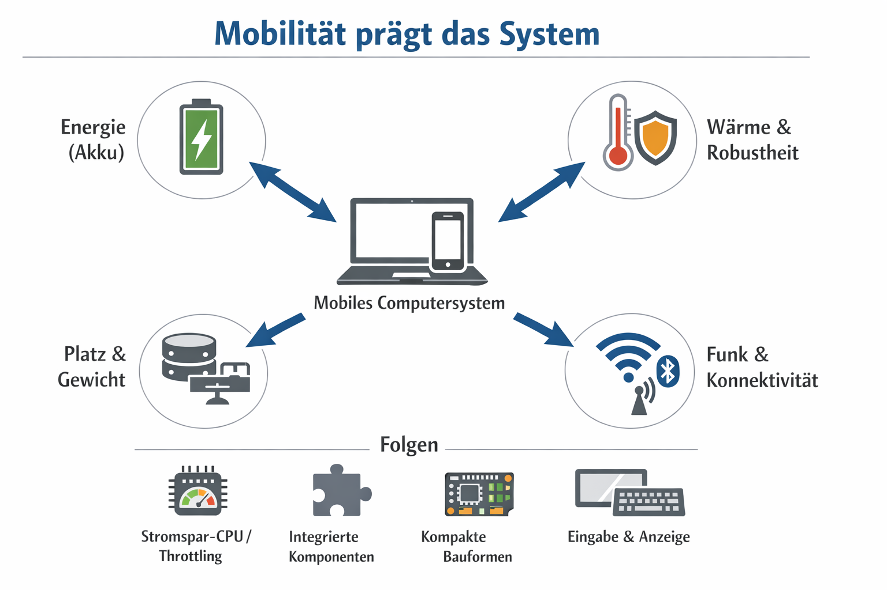

<!--
author: Herr J. Müller

titel: Einzelplatz-Computersysteme konfigurieren und in Betrieb nehmen (II) 

icon: assets/BSO_LOGO_1.png

email:  Jan.Mueller4@schule.hessen.de

version:  0.1.0

language: de

narrator: Deutsch Female

comment: https://liascript.github.io/course/?https://raw.githubusercontent.com/JMueller-edu/SJ2526/refs/heads/main/LF14BFIT2526.md#1

link:     https://cdn.jsdelivr.net/chartist.js/latest/chartist.min.css

script:   https://cdn.jsdelivr.net/chartist.js/latest/chartist.min.js

import: https://raw.githubusercontent.com/liaScript/mermaid_template/master/README.md

-->

# IT-Essentials 

[qr-code](https://liascript.github.io/course/?https://raw.githubusercontent.com/JMueller-edu/SJ2526/refs/heads/main/LF14BFIT2526.md#1)

https://t1p.de/12BFIT2526LF14

## So bleiben System zuverlässig

**Fundamentale Idee So bleiben Systeme zuverlässig**

<section>

***Systeme funktionieren dauerhaft zuverlässig, wenn man sie kontinuierlich vorbeugend pflegt und auftretende Probleme systematisch analysiert, um deren Ursachen nachhaltig zu beseitigen.***

</section>

---

**Impulsfragen: Reflektiere dein Umgang mit Technik**

     {{1-2}}
<section>

>Warum verlassen wir uns im Alltag so sehr auf funktionierende digitale Geräte, aktualisieren sie aber oft erst, wenn etwas nicht mehr richtig funktioniert? 

Erwartungshorizont

Die Antwort soll erkennen lassen, dass junge Erwachsene:
- digitale Geräte als selbstverständlich funktionierend wahrnehmen
- oft erst reagieren, wenn spürbare Probleme auftreten (z. B. Handy wird langsam, Laptop stürzt ab)
- Updates, Reinigung, Datensicherung oder Wartung als „unnötige Mühe“ wahrnehmen, solange alles läuft
- verstehen, dass moderne Technologien komplex sind und regelmäßige Pflege brauchen, um zuverlässig zu bleiben erkennen, dass präventive Maßnahmen Störungen verhindern und langfristig Zeit und Kosten sparen

</section>

     {{2-3}}
<section>

>Wie beeinflusst es unseren Alltag, wenn wir technische Probleme sofort lösen wollen, aber selten Zeit investieren, um vorzubeugen?

Erwartungshorizont

Die Antwort soll zeigen, dass junge Erwachsene:
- den „Instant-Mindset“ der modernen Gesellschaft erkennen (alles soll schnell, sofort, ohne Mühe funktionieren)
- verstehen, dass Vorsorge weniger sichtbar ist und daher kulturell oft nicht belohnt wird
- erkennen, dass ständige Erreichbarkeit und digitale Abhängigkeit Prävention eigentlich wichtiger machen
- wahrnehmen, dass mangelnde vorbeugende Pflege Stress erzeugen kann (z. B. wenn das Handy genau jetzt ausfällt)
- reflektieren, wie persönliches Verhalten technische Ausfälle beeinflussen kann (z. B. Datenverlust ohne Backup)

</section>

---

**Praxisbeispiel: IT-Systeme als Modell für zuverlässige Technik**

     {{3-4}}
<section>

***Ein anschauliches Beispiel für diese fundamentale Idee sind IT-Systeme. Auch sie funktionieren nur dann zuverlässig, wenn man sie regelmäßig vorbeugend wartet und Probleme mit einer klaren, strukturierten Methode löst.***

</section>

---

**Deine Aufgabe: Praxisnahes Lernen in der Cisco Networking Academy**

     {{4-5}}
<section>

1. Rufe den [Login der Cisco Networking Academy](https://www.netacad.com/) auf!

2. Melde dich dort mit deinen Zugangsdaten an.
   
3. Wähle im Dashboard unter `My Classes` den Kurs `12BFIT IT Essentials 7 25/26` aus.
   
4. Bearbeite darin das `Kapitel 4`!

    - ***Erstelle dir dabei Notizen nach der [Cornell-Methode](https://www.youtube.com/watch?v=nX-xshA_0m8)*** 

    - ***Du kannst dafür diese [Vorlage](assets/cornellNotes.pdf) verwenden***
</section>

---

**Plenumsdiskussion: So sorgst du für zuverlässige Technik im Alltag**

     {{5-6}}
<section>

>Welche einfachen Routinen könntest du in deinen Alltag einbauen, um dafür zu sorgen, dass dein Laptop oder Smartphone auch dann zuverlässig funktioniert, wenn du es dringend brauchst?

Erwartungshorizont

Die Antwort sollte erkennen lassen, dass junge Erwachsene konkrete, realistische Alltagsmaßnahmen identifizieren, z. B.:
- regelmäßige automatische Updates aktivieren
- einmal pro Woche Daten in der Cloud sichern
- Gerät gelegentlich reinigen (Staub, Display)
- unnötige Apps löschen, Speicher freihalten
- Akku schonend verwenden
- beim ersten Warnzeichen (Hitze, Geräusche, Fehlermeldung) nach Ursachen suchen statt ignorieren
Sie sollen zeigen, dass sie:
- Verantwortung für ihre eigene digitale Infrastruktur übernehmen
- präventive Maßnahmen als zeitsparend und nützlich verstehen
- den Nutzen für Studium, Ausbildung, Freizeit, Kommunikation erkennen

</section>

---

## Mobilität prägt das System

     {{0-1}}
<section>

>Mobile Geräte sind vollwertige Computersysteme, deren Aufbau und Nutzung konsequent durch Mobilitäts-Zwänge geprägt sind (Energie, Platz, Robustheit, Funk-Konnektivität).
>
>>Daraus folgen spezielle Bauformen, Komponenten und Kompromisse: z. B. kleinere Formfaktoren, proprietäre Mainboards, stromsparende CPUs (inkl. Throttling), integrierte Ein-/Ausgabe und Funkmodule – bei grundsätzlich gleichen Grundfunktionen wie beim Desktop (Rechnen, Speichern, Kommunizieren, Ein-/Ausgeben).

</section>

---

**Impulsfragen:**

     {{1-2}}
<section>

>Wer von euch nutzt täglich ein mobiles Gerät als „Hauptcomputer“ – und warum?

</section>

     {{2-3}}
<section>

>Welche Situation stresst mobile Geräte am meisten: Videocall, Gaming, Zugfahrt, draußen arbeiten – warum?

</section>

---

**Einzelarbeit:**

     {{4-5}}
<section>

1. Rufe den [Login der Cisco Networking Academy](https://www.netacad.com/) auf!

2. Melde dich dort mit deinen Zugangsdaten an.
   
3. Wähle nach dem Login im Dashboard unter `My Classes` den Kurs `12BFIT IT Essentials 7 25/26` aus.
   
4. Bearbeite das Kapitel `17.1`!

    - ***Erstelle dir dabei Notizen nach der [Cornell-Methode](https://www.youtube.com/watch?v=nX-xshA_0m8)*** 

    - ***Du kannst dafür diese [Vorlage](assets/cornellNotes.pdf) verwenden***

5. Absolviere das folgende Quiz.

</section>

---

**Quiz:**

     {{5-6}}
<section>
Welche Aussage beschreibt „Mobilität“ im IT-Kontext am treffendsten??

<!-- data-solution-button="off" data-randomize -->
- [( )] Mobilität bedeutet, dass ein Gerät ausschließlich zu Hause genutzt wird.
- [(x)] Mobilität bedeutet, dass man von verschiedenen Orten aus auf Informationen und Dienste zugreifen kann.
- [( )] Mobilität bedeutet, dass ein Gerät nur über ein Kabelnetzwerk funktioniert.
- [( )] Mobilität bedeutet, dass ein Gerät keine Batterie oder keinen Akku benötigt.
</section>

     {{6-7}}
<section>
Welche Aussage beschreibt eine typische Funktion von Smartphones im Zusammenspiel mit anderen Geräten??

<!-- data-solution-button="off" data-randomize -->
- [( )] Ein Smartphone kann grundsätzlich keine anderen Geräte mit dem Internet verbinden.
- [(X)] Ein Smartphone kann als Verbindungsglied dienen, indem es Daten anderer Geräte weiterleitet.
- [( )] Ein Smartphone kann nur über Ethernet-Kabel eine Verbindung herstellen.
- [( )] Ein Smartphone kann ausschließlich zum Telefonieren genutzt werden.
</section>

     {{7-8}}
<section>
Welche Aussage zu M.2-Speicher trifft am ehesten zu?

<!-- data-solution-button="off" data-randomize -->
- [( )] M.2 ist ein sehr großer Formfaktor, der vor allem für 3,5-Zoll-Festplatten gedacht ist.
- [(x)] M.2 ist ein kompakter Formfaktor, der sich besonders für platzsparende Geräte eignet.
- [( )] M.2 ist ein Displayanschluss, der Monitorbilder überträgt.
- [( )] M.2 ist ein Funkstandard, der WLAN ersetzt.

</section>

     {{8-9}}
<section>
Welche Aussage beschreibt NVMe am besten?

<!-- data-solution-button="off" data-randomize -->
- [(x)] NVMe ist eine Schnittstelle, die schnelle SSD-Zugriffe ermöglicht.
- [( )] NVMe ist eine Art optisches Laufwerk für DVDs.
- [( )] NVMe ist ein Kabelstandard für Ethernet.
- [( )] NVMe ist ein Bluetooth-Profil für Audioübertragung.
</section>

     {{9-10}}
<section>
Welche Aussage beschreibt den Unterschied zwischen LCD/LED und OLED am treffendsten?

<!-- data-solution-button="off" data-randomize -->
- [(x)] OLED-Pixel erzeugen ihr Licht selbst, während LCD/LED typischerweise eine Hintergrundbeleuchtung nutzen.
- [( )] LCD/LED-Pixel erzeugen ihr Licht selbst, während OLED immer eine Hintergrundbeleuchtung benötigt.
- [( )] OLED kann grundsätzlich keine Farben darstellen, während LCD/LED Farben darstellen kann.
- [( )] OLED funktioniert nur mit externer Stromversorgung und nie mit Akku.
</section>

     {{10-11}}
<section>
Welche Aussage beschreibt einen Digitizer bei Touchscreens korrekt?

<!-- data-solution-button="off" data-randomize -->
- [(x)] Ein Digitizer ist eine Komponente, die Berührungen erfasst und in digitale Signale umwandelt.
- [( )] Ein Digitizer ist ein Bauteil, das ausschließlich die CPU-Kühlung steuert.
- [( )] Ein Digitizer ist ein Akkutyp, der besonders schnell lädt.
- [( )] Ein Digitizer ist ein Programm, das nur im BIOS läuft.
</section>

---

**Plenumsdiskussion:**

     {{11-12}}
>„Sollte Reparierbarkeit gesetzlich stärker vorgeschrieben werden, auch wenn Geräte dann dicker oder teurer werden?“

     {{12-13}}
>„Entsteht durch mobile Technik eher mehr Teilhabe (Bildung/Information) oder eher mehr Ungleichheit (Kosten/Abhängigkeiten)?“

---