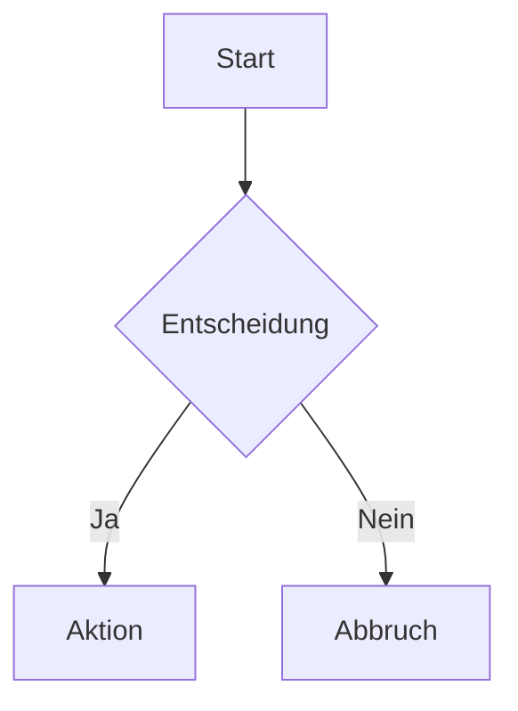

Hier ist ein umfassendes **Markdown-Beispiel**, das nahezu alle von **GitHub unterstützten Inhaltstypen** (GitHub Flavored Markdown – GFM) demonstriert:

------

# 🧾 Markdown Komplettbeispiel (GitHub)

## 1. Überschriften

# H1

## H2

### H3

#### H4

##### H5

###### H6

------

## 2. Textformatierung

**Fett**
*Kursiv*
***Fett & Kursiv***
~~Durchgestrichen~~

> Blockquote
>
> > Verschachteltes Zitat

------

## 3. Listen

### Ungeordnete Liste

- Punkt A
- Punkt B
  - Unterpunkt B1
  - Unterpunkt B2

### Geordnete Liste

1. Erster Punkt
2. Zweiter Punkt
   1. Unterpunkt

### Task List (Checkboxen)

-  Erledigt
-  Offen


## 4. Code

### Inline-Code

Das ist `inline code`.

### Codeblock

```javascript
function greet(name) {
  console.log("Hallo " + name);
}
greet("Welt");
```

------

## 5. Tabellen

| Name | Alter | Stadt   |
| ---- | ----- | ------- |
| Max  | 30    | Berlin  |
| Anna | 25    | München |

------

## 6. Links

[GitHub](https://github.com/)

Autolink: [https://github.com](https://github.com/)

------

## 7. Bilder

```markdown

```

------

## 8. Horizontale Linie

------

------

------

------

## 9. Zitate & Hervorhebungen

> ⚠️ Hinweis: Das ist ein wichtiger Hinweis.

------

## 10. Emojis

😄 🚀 👍
(oder `:smile:` auf GitHub)

------

## 11. Fußnoten (GFM)

Das ist ein Text mit Fußnote[1](https://chatgpt.com/c/69dd3e13-d5f8-838b-9748-152dd3bbb41d#user-content-fn-1).

------

## 12. Definitionen (Workaround)

**Begriff**
: Beschreibung dazu

------

## 13. HTML (GitHub unterstützt HTML!)

Versteckter Inhalt 👀

------

## 14. Diagramme (Mermaid – GitHub unterstützt das!)



------

## 15. Mathematische Formeln (eingeschränkt auf GitHub)

Inline: $E = mc^2$

Block:

$$
\int_0^1 x^2 dx
$$

------

## 16. Tastenkombinationen

Strg + C

------

## 17. Erwähnungen & Referenzen (GitHub spezifisch)

@username
\#123 (Issue)

------

## 18. Diff-Code (für Änderungen)

```diff
- alte Zeile
+ neue Zeile
```

------

## 19. Alerts (GitHub spezielle Syntax)

> [!NOTE]
> Das ist eine Notiz

> [!WARNING]
> Warnung!

> [!TIP]
> Tipp!


------

## 20. Escape-Zeichen

*kein kursiv*

------

Wenn du willst, kann ich dir auch eine **optimierte Vorlage für README.md** erstellen oder das Ganze speziell für dein Projekt anpassen (z. B. Dokumentation, Portfolio, etc.).

## Footnotes

1. Das ist die Fußnote. [↩](https://chatgpt.com/c/69dd3e13-d5f8-838b-9748-152dd3bbb41d#user-content-fnref-1)